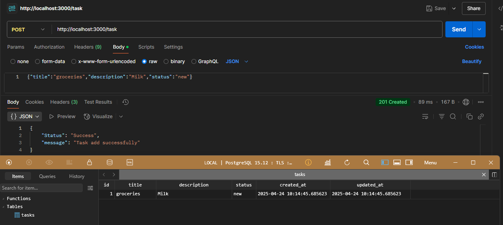
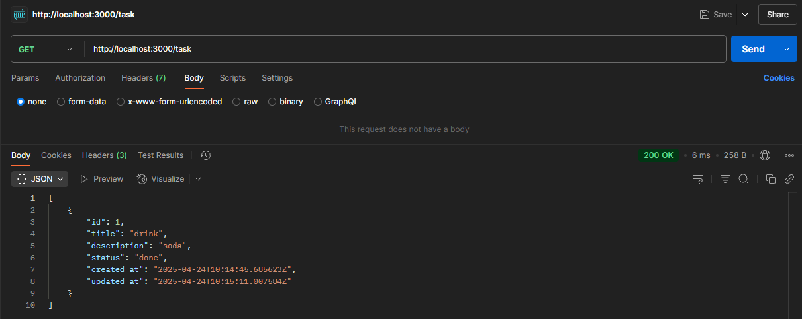
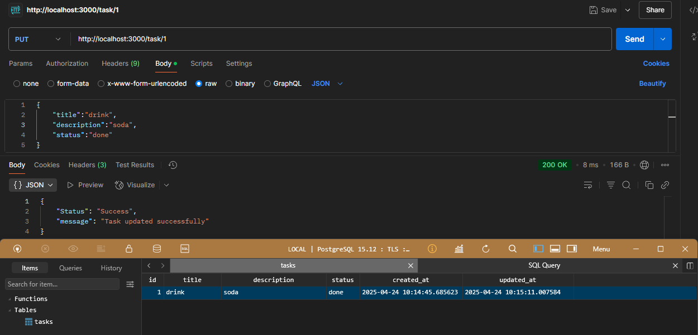
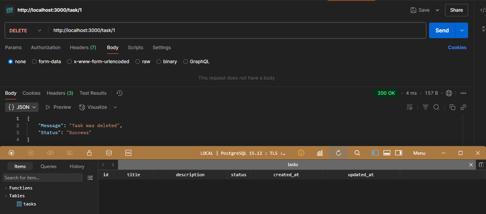

## 📌 Что сделал

Реализация CRUD, сделал миграцию и завернул всё это в Docker.

## 🛠 Стек

- Go + Fiber
- PostgreSQL (через pgx )
- Среда выполнения – Docker

## 📂 Структура БД

```PostgreSQL
   id SERIAL PRIMARY KEY
   title TEXT NOT NULL
   description TEXT
   status TEXT CHECK (status IN ('new', 'in_progress', 'done')) DEFAULT 'new'
   created_at TIMESTAMP DEFAULT now()
   updated_at TIMESTAMP DEFAULT now()
```

## Основные эндпоинты

| Метод  | Эндпоинт      | Параметры (JSON)                                              | Описание                    |
| ------ | ------------- | ------------------------------------------------------------- | --------------------------- |
| POST   | `/tasks`      | `{"title": string, "description": string, "status": string}`  | Cоздание задачи             |
| GET    | `/tasks`      | -                                                             | Получение списка всех задач |
| PUT    | `/tasks/{id}` | `{"title": string, "description": string, "status": string} ` | Обновление задачи           |
| DELETE | `/tasks/{id}` | -                                                             | Удаление задачи             |

## Как это тестировать

- Установленный Docker
- Go 1.20+

Собрать билд

```
cd test-task-TODO
```

```
docker-compose up --build
```

## Результаты

POST


GET


PUT


DELETE

